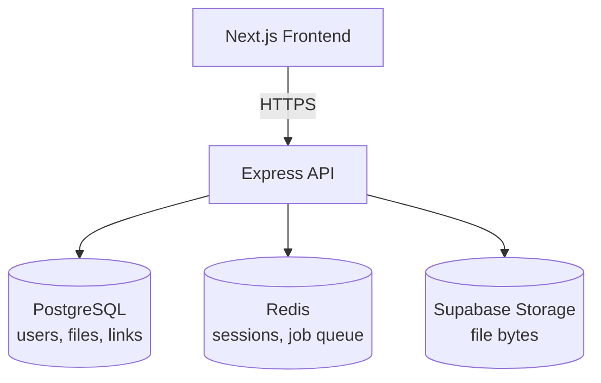
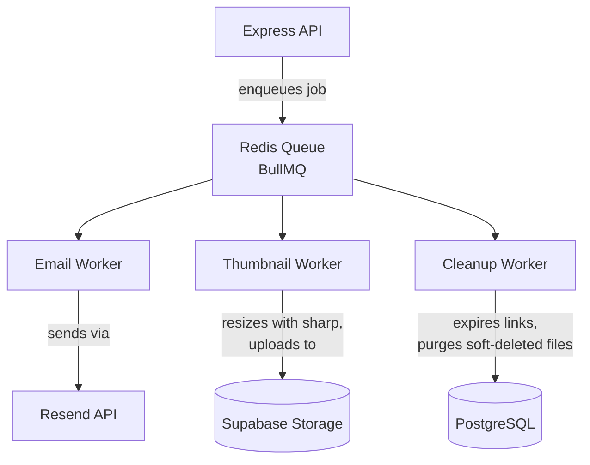
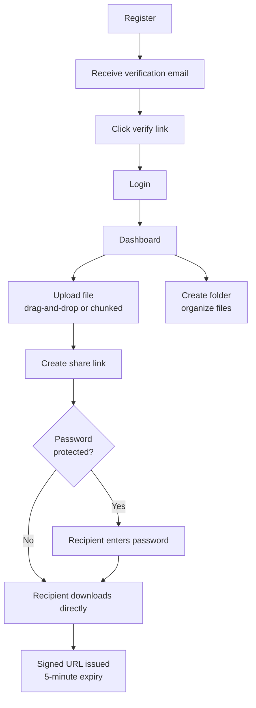

# SecureShare — System Diagrams

Three diagrams covering how requests flow through the system, how background jobs are processed, and what a user actually does moving through the app. Rendered automatically by GitHub, GitLab, and most markdown viewers (Mermaid syntax).

---

## 1. System Architecture

The frontend never talks to the database, Redis, or storage directly — everything routes through the Express API.

---

## 2. Background Job Flow

Emails, thumbnail generation, and cleanup tasks never block a request — the API enqueues a job and returns immediately; a worker processes it separately.

---

## 3. User Journey

The path a new user takes from signing up to a recipient downloading their shared file.

---
 