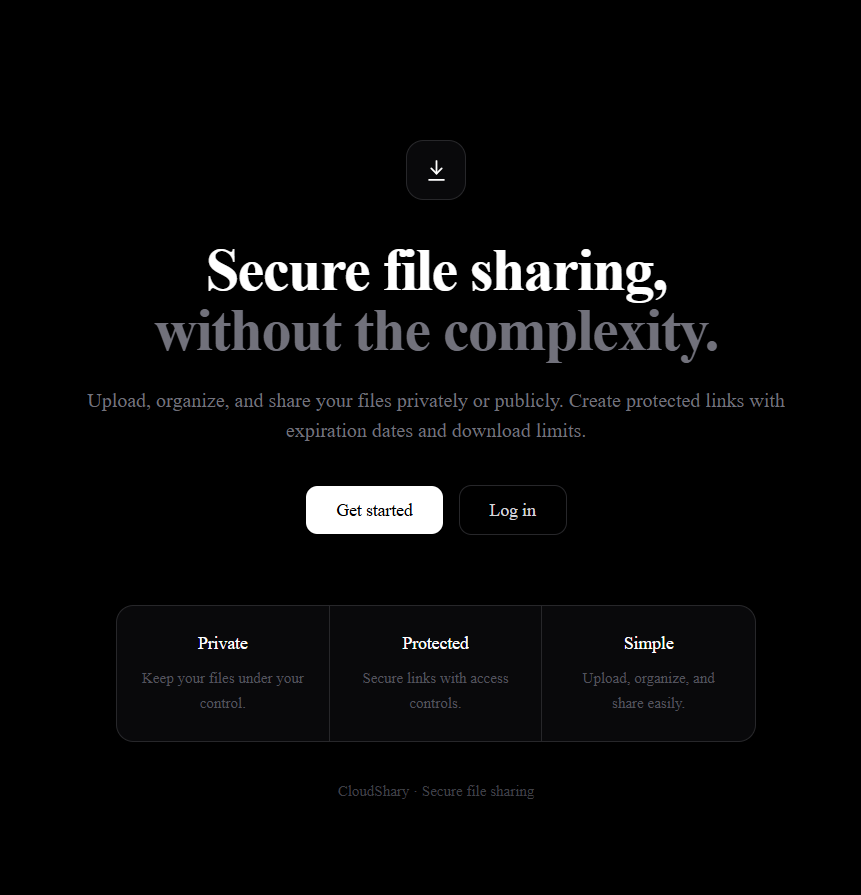
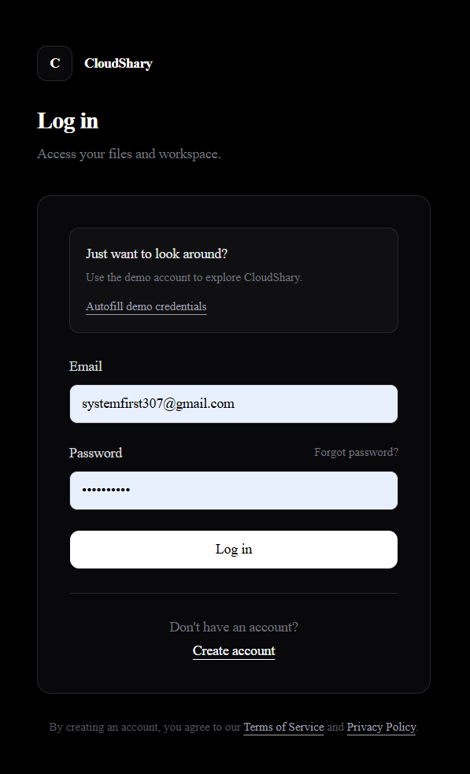
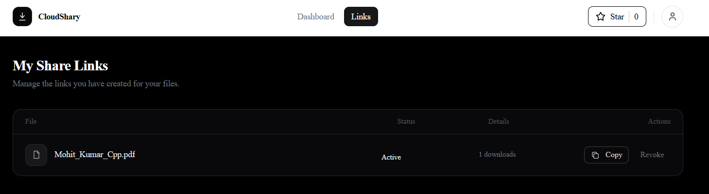

# CloudShary — Secure Cloud File Sharing Platform

A full-stack file sharing platform with drag-and-drop uploads, chunked/resumable large file support, folder organization, and public/private share links with password protection and expiration.

**Live demo:** `[https://your-project.vercel.app](https://could-shary.vercel.app/)` — login with `systemfirst307@gmail.com` / `Demo@123` to look around without registering.

---

## Features

- **Auth**: register, login, email verification, forgot/reset password, delete account, JWT access + refresh tokens with silent renewal
- **Uploads**: drag-and-drop, chunked/resumable uploads for large files (survives network drops and page refreshes), content-hash deduplication, automatic thumbnail generation for images
- **Organization**: nested folders, drag-and-drop file organization, move/rename/delete with recursive soft-delete
- **Sharing**: public and private share links, password protection, expiration dates, download limits, share with specific people by email (with VIEW/DOWNLOAD/EDIT permissions)
- **Background jobs**: expired-link cleanup, soft-deleted file purging, thumbnail generation, transactional email — all queued via BullMQ/Redis, visible in a Bull Board dashboard
- **Admin panel**: view all users, promote/demote roles, suspend accounts, force-delete accounts, platform-wide stats
- **Security**: bcrypt password hashing, rate limiting on auth/upload/password-guess endpoints, ownership checks on every resource, helmet + locked CORS, MIME-type allowlisting, short-lived signed URLs for all file access

## Tech Stack

| Layer | Technology |
|---|---|
| Frontend | Next.js (App Router), React, Tailwind CSS, shadcn/ui |
| Backend | Node.js, Express, TypeScript |
| Database | PostgreSQL, Prisma ORM |
| File Storage | Supabase Storage |
| Queue/Cache | Redis, BullMQ |
| Email | Resend |
| Local Infra | Docker Compose (Postgres + Redis) |
| Deployment | Vercel (frontend), Render (backend + Postgres + Redis) |

---

## Getting Started (Local Development)

### Prerequisites
- Node.js 20+
- Docker Desktop
- A Supabase account (free tier) for storage
- A Resend account (free tier) for email

### 1. Clone and install

```bash
git clone <your-repo-url>
cd <repo-name>

cd backend && npm install
cd ../frontend && npm install
```

### 2. Start local infrastructure

```bash
# from repo root
cp .env.example .env
docker compose up -d
```

Confirm both containers are healthy:
```bash
docker compose ps
```

### 3. Configure environment variables

Copy `.env.example` to `.env` in `backend/`, and fill in:
- `DATABASE_URL` — already points at your local Docker Postgres by default
- `REDIS_URL` — already points at local Docker Redis by default
- `SUPABASE_URL`, `SUPABASE_SERVICE_ROLE_KEY`, `SUPABASE_STORAGE_BUCKET` — from your Supabase project
- `RESEND_API_KEY`, `EMAIL_FROM` — from your Resend account
- `JWT_ACCESS_SECRET`, `JWT_REFRESH_SECRET` — generate with `node -e "console.log(require('crypto').randomBytes(64).toString('hex'))"`
- `FRONTEND_URL` — `http://localhost:3000` for local dev

Copy `.env.local.example` to `.env.local` in `frontend/`:
- `NEXT_PUBLIC_API_BASE_URL=http://localhost:4000`

### 4. Set up the database

```bash
cd backend
npx prisma migrate dev
npx prisma db seed   # creates the demo account
```

### 5. Run both apps

```bash
# terminal 1
cd backend && npm run dev

# terminal 2
cd frontend && npm run dev
```

Visit `http://localhost:3000`.

---

## Project Structure

```
├── backend/
│   ├── src/
│   │   ├── controllers/     # handlers, organized by resource
│   │   ├── routes/          # Express route handlers
│   │   ├── middleware/      # requireAuth, requireRole
│   │   ├── workers/         # BullMQ background job workers
│   │   ├── queues/          # BullMQ queue definitions + scheduler
│   │   ├── utils/           # password hashing, JWT helpers
│   │   └── db.ts            # Prisma client singleton
│   └── prisma/
│       ├── schema.prisma
│       └── seed.ts
├── frontend/ 
│       ├── app/              # Next.js App Router pages
│       ├── components/       # Shared React components
│       └── lib/              # apiFetch, authContext, chunked upload logic
└── docker-compose.yml         # Local Postgres + Redis
```

See [`IMPLEMENTATION.md`](./IMPLEMENTATION.md) for full architecture details, database schema, and the complete API reference.

---

## Deployment

- **Frontend**: deployed on Vercel with Root Directory set to `frontend`
- **Backend**: deployed on Render (native Node, not Docker) with Postgres and Key Value (Redis) add-ons; `npx prisma migrate deploy` runs as a Pre-Deploy Command

See [`IMPLEMENTATION.md`](./IMPLEMENTATION.md) for the full deployment walkthrough.

---
## Landing Page


## Login Page


## Dashbaord


## Links 



